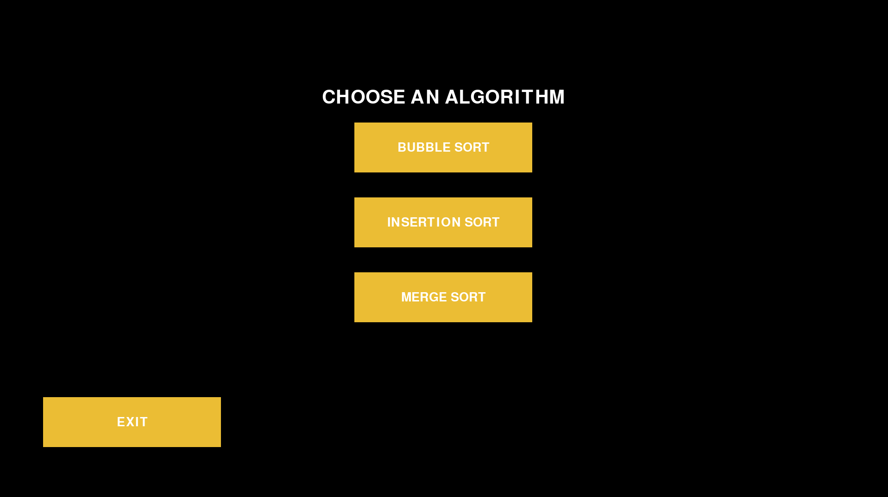
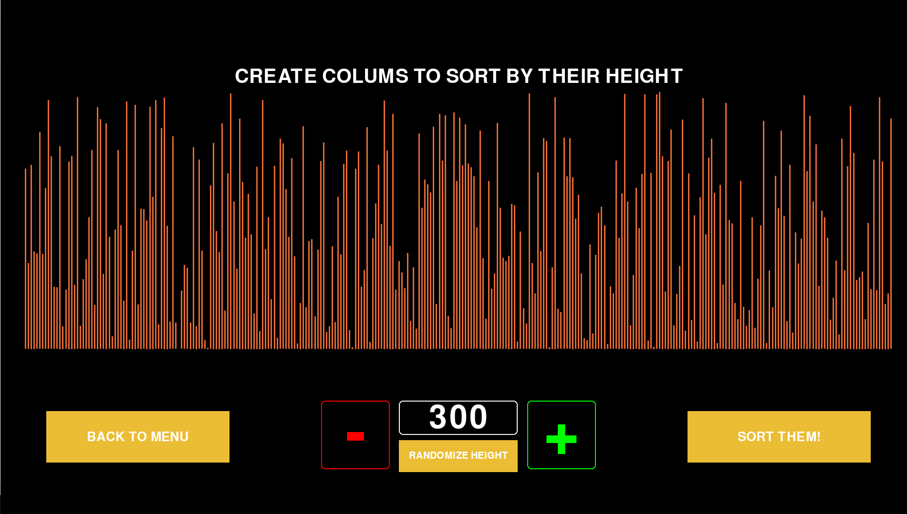
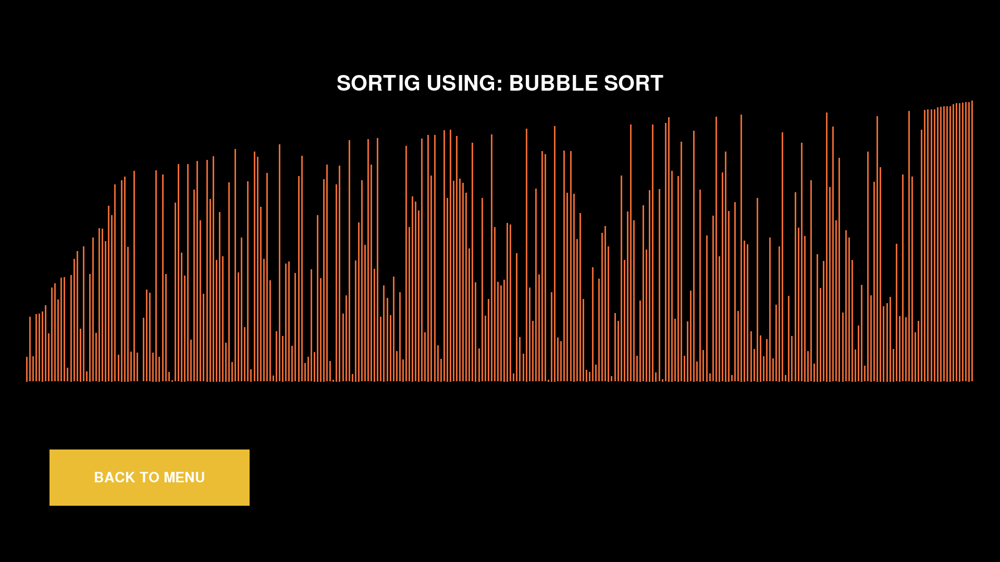
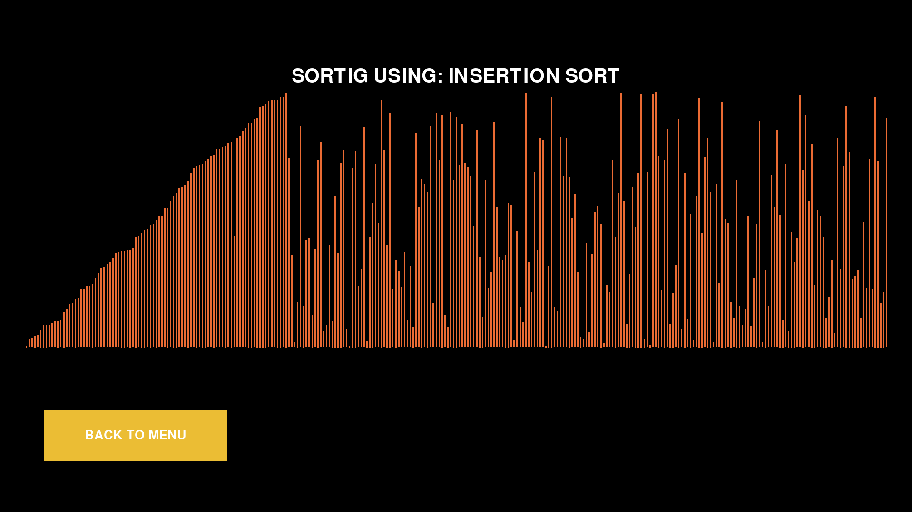
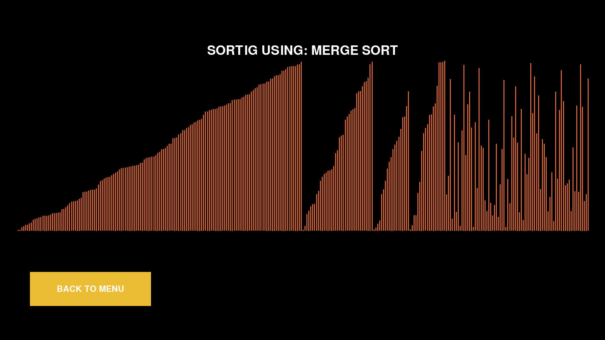

# Sorting Algorithms Visualization
---
This project visualize operating of three sorting algoritms:
1. Bubble Sort
1. Insertion Sort
1. Merge Sort



User can create a list that consists up to 800 elements that are integers represented by colums with height proportional to their values. The number of columns can be dynamically changed by entering a new value in the box, or increasing/decreasing it using the +/- signs. 
If the user is not satisfied with the distribution of the column heights, he may draw new ones. The width of the columns scales with their number so that they occupy 95% of the screen width.
The list is then sorted using the selected algorithm. 



Functions responsible for sorting lists using various methods have been transformed into generators.
```python
def bubble_sort(alist):
    '''bubble sort action generator'''
    for i in range(len(alist), 1, -1):
        for j in range(1, i):
            if alist[j] < alist[j-1]:
                alist[j], alist[j-1] = alist[j-1], alist[j]
                yield alist
```
Merge sort uses recursion, therefore changing it into the generator is more complicated:
```python
def merge_sort(alist):
    '''merge sort action generator'''
    def ms_rec(start, end):
        if end - start > 1:
            mid = (start + end) // 2

            yield from ms_rec(start, mid)
            yield from ms_rec(mid, end)
            left = alist[start:mid]
            right = alist[mid:end]
        
            left_index = 0
            right_index = 0
            main_index = start

            while left_index < len(left) and right_index < len(right):
                bufor = alist[:]
                if right[right_index] < left[left_index]:
                    alist[main_index] = right[right_index]
                    right_index += 1
                else:
                    alist[main_index] = left[left_index]
                    left_index += 1
                main_index += 1
                if bufor != alist: yield alist
            
            while left_index < len(left):
                bufor = alist[:]
                alist[main_index] = left[left_index]
                left_index += 1
                main_index += 1
                if bufor != alist: yield alist

            while right_index < len(right):
                bufor = alist[:]
                alist[main_index] = right[right_index]
                right_index += 1
                main_index += 1
                if bufor != alist: yield alist

    yield from ms_rec(0, len(alist))
```
Function yields the subsequent operations performed on the list, after each such operation the program pauses for a moment, using the sleep() function from the time module. This time is inversely proportional to the length of the list.
```python
            if not sorted:
                try:
                    next(self.algorithm)
                    sleep(1/self.number_of_colums)
                except StopIteration:
                    sorted = True
```
Due to this actions we end up with a smooth simulation.


Importantly, the selected column configuration is remembered and can be sorted once again using a different algorithm. This and the fact that you can sort both small and relatively large amounts of data makes it easy to see the difference in the time of sorting different data sets with different algorithms.



Obviously, the larger the data set is, the greater the advantage of merge sort over the other algorithms.


